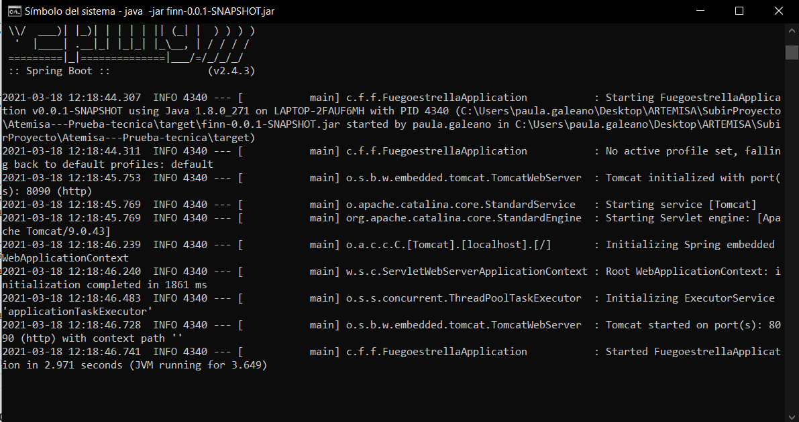

Operación Fuego de Estrella de Neutrones

1. Descomprimir el proyecto fuegoestrella.zip

2. Abrir el proyecto y ubicarse en la ruta del proyecto 

3. Ejecutar el comando mvn paquete limpio, se creaa un ejecutable dentro de la carpeta "target" 

4. En el consolador ubicarse en nombreproyecto/target y ejecutar el comando java -jar nombreApp.jar

5. Consumir servicios de Postman
Pasamos la siguiente información para generar las pruebas. 

● Kenobi: [-500, -200] 
● Skywalker: [100, -100] 
● Solo: [500, 100]

{ 
"satélites": [ 
    { 
 "nombre": "kenobi", 
 "distancia": 100.0, 
 "mensaje": ["este", "", "", "mensaje", ""] 
    }, 
    { 
 "nombre": "skywalker", 
 "distancia": 115,5 
 "mensaje": ["", "es", "", "", "secreto"] 
    }, 
    { 
 "nombre": "solo", 
 "distancia": 142,7 
 "mensaje": ["este", "", "un", "", ""] 
    } 
  ] 
} 

Para el nivel 2 
Post : http://localhost:8090/topsecret
 

Para el nivel 3 
Publicación : http://localhost:8090/topsecret_split/{satellite_nombre} 
 

Obtener : http://localhost:8090/topsecret_split/{satellite_nombre} 
 

En caso de que la información llegue incompleta retornara un mensaje de error
 

